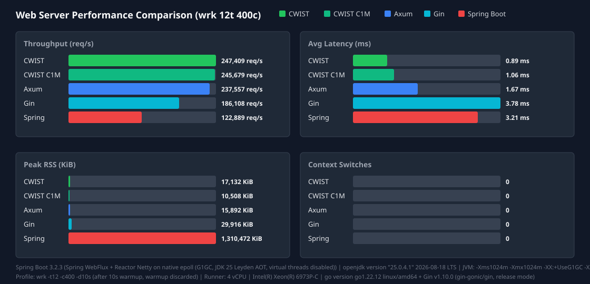

<p align="center">
  
</p>

<h1 align="center">CWIST</h1>
<p align="center"><strong>C Web development Is Still Trustworthy</strong></p>
**Implementations powered by lsquic/BoringSSL/OpenSSL without context contamination.**

<p align="center">
A high-performance, C17 web framework that brings modern ergonomics—HTTP/3, WebTransport,
Post-Quantum TLS, and zero-copy I/O—to systems programming without sacrificing control.
</p>

[Heavy Benchmark on CWIST APP](https://github.com/gg582/fly.board/blob/main/README.md)

<!-- WEBSERVER_BENCHMARKS:START -->
Latest Web Server Benchmark (wrk 12t 400c):
- **CWIST**: 62305 req/s | Latency 0.44ms | RSS 12212KiB | Csw 0
- **Axum**: 113488 req/s | Latency 3.46ms | RSS 16704KiB | Csw 0
- **Spring Boot**: 39668 req/s | Latency 10.27ms | RSS 579832KiB | Csw 0

Spring runtime env: **openjdk version "21.0.11" 2026-04-21 LTS**, Spring Boot **3.2.3** (Spring WebFlux + Reactor Netty (event loop, virtual threads enabled)), virtual threads **on**, JVM opts `-Xms512m -Xmx512m -XX:SharedArchiveFile=/tmp/spring_bench/app.jsa (CDS AOT cache)`, warmup/profile: wrk -t12 -c400 -d10s (after 10s warmup, warmup discarded)


<!-- WEBSERVER_BENCHMARKS:END -->

_Methodology, JVM options, and fairness settings: [docs/webserver-benchmark.md](docs/webserver-benchmark.md)_

---

## Why CWIST?

Most C web frameworks stop at HTTP/1.1 and leave TLS, protocol upgrades, and memory
management as exercises for the user. CWIST ships with the entire stack:

- **HTTP/3 & WebTransport** powered by lsquic (server-side sessions plus an experimental
  native C client on `dev`, backed by LSQUIC PR #629).
- **Post-Quantum TLS** via a single API call: `cwist_app_use_pqc_layer(app, true)`
  forces hybrid X25519MLKEM768 and disables legacy TLS < 1.3. No OpenSSL knowledge required.
- **Server-side zero-copy I/O & C100K Reactor** backed by io_uring / epoll / kqueue with lock-free
  job queues and generational arena allocators from libttak.
- **Nuke DB**: a read-optimal, in-memory SQLite engine that syncs to disk on every COMMIT.
- **Auto-RDBMS Detection**: probe any TCP port and automatically mount PostgreSQL, MySQL,
  or MariaDB runtimes by wire-protocol fingerprinting.

## Core Features

| Layer | What you get |
|-------|-------------|
| **Protocols** | HTTP/1.1, HTTP/2 (h2/h2c), HTTP/3 (QUIC), WebSocket, WebTransport |
| **TLS / Security** | BoringSSL, PQC hybrid groups, ECH, JWT, DB Crypt, Monocypher |
| **Database** | SQLite3 + ORM, Nuke DB (in-memory + WAL sync), RDBMS auto-detection |
| **Routing** | Express-style `:param` routes, Mux router, chainable middleware |
| **Performance** | Zero-copy I/O, generational arenas, EBR GC, lock-free queues, Big Dumb Reply cache |
| **Observability** | Structured access logs, metrics endpoint, healthz, rate limiting |
| **gRPC / Protobuf** | Unary and streaming routes, incremental framing, health/reflection services, and `cwist proto` scalar-model generation |
| **Rendering** | HTML builder, CSS composer, template engine, JSON builder / heal |

## Quick Start

```sh
git clone https://github.com/religiya-serdtsa/cwist.git
cd cwist
make
```

## Platform support

CWIST builds on Linux, macOS, and BSD systems. The HTTP/3 server and native
client use non-blocking UDP sockets on every platform; Linux uses `epoll`,
while BSD-family systems use the portable polling path. ECN metadata is
enabled only when the host exposes the required socket option and ancillary
data interfaces, so an unavailable optional API does not prevent an HTTP/3
build.

```c
#include <cwist/app.h>

static void hello(cwist_http_request *req, cwist_http_response *res) {
    (void)req;
    cwist_sstring_assign(res->body, "Hello from CWIST!");
}

int main(void) {
    cwist_app *app = cwist_app_create();

    /* SQLite + ORM-ready database */
    cwist_app_use_db(app, ":memory:");

    /* Post-Quantum TLS (hybrid X25519MLKEM768) */
    cwist_app_use_pqc_layer(app, true);

    /* Observability endpoints */
    cwist_app_enable_metrics(app);
    cwist_app_enable_healthz(app);

    /* Auto-detect PostgreSQL / MySQL / MariaDB on localhost */
    cwist_app_auto_rdbms(app, 5432);

    /* Routes */
    cwist_app_get(app, "/", hello);

    cwist_app_listen(app, 8080);
    cwist_app_destroy(app);
    return 0;
}
```

```sh
gcc -o server main.c \
    -lcwist \
    -lssl -lcrypto \
    -lz -lzstd -lbrotlienc -lbrotlicommon \
    -luriparser -lcjson \
    -ldl -lpthread -lm
./server
```

## Development hot reload

New projects include a self-describing `.cwpro` development command. Run the
watcher from the project directory to calculate the affected translation units,
incrementally invoke the build, and restart the app only after a successful
build. It uses Linux `inotify` or BSD/macOS `kqueue` for low-latency wakeups,
with an mtime snapshot and polling fallback to prevent missed rebuilds. The
previous process remains available if a build fails.

```sh
cwist watcher
```

Use `cwist watcher --no-run` for CI or rebuild-only use, or `--poll` to force
portable polling. `dev.debounce_ms` and
`dev.stop_timeout_ms` in the manifest control atomic-save coalescing and
graceful process shutdown.

## Linking

When you link against `libcwist.a`, you must supply the following flags.
Because CWIST is a **static** archive, the linker needs all transitive
dependencies to be listed explicitly by the application.

### Required flags (always needed)

| Flag | Provides |
|------|----------|
| `-lcwist` | The framework itself |
| `-lssl -lcrypto` | TLS (BoringSSL or OpenSSL) |
| `-lz` | zlib — gzip/deflate compression and internal use |
| `-lzstd` | Zstandard — payload compression (preferred algorithm) |
| `-lbrotlienc -lbrotlicommon` | Brotli — payload compression |
| `-luriparser` | URI parsing |
| `-lcjson` | JSON handling |
| `-ldl` | Dynamic loading (RDBMS auto-mount) |
| `-lpthread` | POSIX threads |
| `-lm` | Math (used by libttak) |

### Optional flags (feature-dependent)

| Flag | When required |
|------|---------------|
| `-lnghttp2` | HTTP/2 support |
| `-lngtcp2 -lngtcp2_crypto_quictls` | HTTP/3 / QUIC |
| `-lnghttp3` | HTTP/3 QPACK |
| `-lcurl` | RDBMS auto-mount wire probing |

### pkg-config snippet for Makefile

```makefile
CWIST_LIBS := -lcwist \
              -lssl -lcrypto \
              -lz -lzstd -lbrotlienc -lbrotlicommon \
              -luriparser -lcjson \
              -ldl -lpthread -lm

# Append optional libs if present on the build host
CWIST_LIBS += $(shell pkg-config --libs libnghttp2  2>/dev/null)
CWIST_LIBS += $(shell pkg-config --libs libngtcp2   2>/dev/null)
CWIST_LIBS += $(shell pkg-config --libs libnghttp3  2>/dev/null)
CWIST_LIBS += $(shell pkg-config --libs libcurl     2>/dev/null || echo -lcurl)

your_target: your_source.c
	$(CC) -o $@ $< $(CWIST_LIBS)
```

> **Note** — `brotlienc` and `brotlicommon` ship as **`libbrotli-dev`** on
> Debian/Ubuntu and **`brotli-devel`** on Fedora/RHEL. `zstd` ships as
> **`libzstd-dev`** / **`libzstd-devel`**.

## Configuration

CWIST bundles a lightweight configuration loader that reads `.env` files and environment variables with optional prefixes.

### Loading `.env` files

```c
cwist_config *cfg = cwist_config_create();
cwist_config_load_file(cfg, ".env");

const char *db_url = cwist_config_get(cfg, "DATABASE_URL");
int workers       = cwist_config_get_int(cfg, "WORKERS", 4);
bool debug        = cwist_config_get_bool(cfg, "DEBUG", false);

cwist_config_destroy(cfg);
```

### Loading environment variables by prefix

```c
cwist_config_load_env(cfg, "CWIST_");
/* Now CWIST_PORT=8080 is accessible as cwist_config_get(cfg, "CWIST_PORT") */
```

### `.env` file format

```bash
# Lines starting with # are comments
PORT=8080
DATABASE_URL="sqlite3:data.db"
DEBUG=true
WORKERS=4
```

- Keys and values are separated by `=`.
- Values may be quoted with double quotes (`"..."`).
- Leading/trailing whitespace around keys and values is trimmed automatically.

### Framework-built-in environment variables

These variables are read directly by the framework runtime (no prefix required):

| Variable | Type | Default | Description |
|----------|------|---------|-------------|
| `CWIST_WORKERS` | integer | `1` | Number of worker processes to fork before entering the event loop. |
| `CWIST_C1M_MODE` | boolean | `true` | Enables the high-concurrency C1M async server loop. Set to `0` or `false` to fall back to a blocking accept loop. |

**C1M Mode's value is theorically ready for C1M Server loop. However, a benchmark failed with file descriptor exhaution. This is theorically calculated. The real benchmark will handle C300K connections.**

Some example applications (e.g. `example/othello-web`) also read the standard `PORT` variable when no explicit port is given.

## Nuke DB

Read-from-RAM, Write-to-Disk. Nuke DB loads an on-disk SQLite file into memory via
`sqlite3_deserialize`, runs `PRAGMA integrity_check`, and then serves every query from RAM.
Every COMMIT triggers a background WAL sync. If bootstrap fails, it falls back to
read-only disk protection mode.

```c
cwist_nuke_init("data.db", 5000);   /* 5-second auto-sync interval */
cwist_db *db = cwist_nuke_get_db();
```

## libttak Performance Core

CWIST links the in-tree **libttak** allocator/reactor toolkit:

- **Generational Arena Allocator** — static assets and BDR blobs are released in one
  shot, eliminating RSS fragmentation.
- **Epoch-Based Reclamation (EBR)** — `ttak_epoch_enter/exit` pin critical sections;
  stale buffers are reclaimed automatically.
- **Detachable Memory** — signal-safe, cache-aligned arenas for TLS write buffers and
  WebSocket frames.
- **Lock-Free Job Queue** — producers push with a single atomic swap; consumers reuse
  detached nodes to prevent fragmentation.

## PQC TLS Layer

Enable post-quantum cryptography with one line:

```c
cwist_app_use_pqc_layer(app, true);
```

This forces `X25519MLKEM768:X25519:P-256`, sets TLS 1.3 as the minimum version, and
strips all legacy TLSv1.0–1.2 ciphers. Application code never touches OpenSSL directly.

## WebTransport

CWIST exposes server-side WebTransport over HTTP/3:

```c
cwist_app_use_webtransport(app, my_wt_handler);
```

The framework handles the CONNECT negotiation, keeps the stream open after 2xx,
and provides `cwist_webtransport_read/write/flush/close/open_bidi/open_uni` APIs.

## RDBMS Auto-Mount

Point CWIST at a local TCP port and it detects the provider by wire protocol:

```c
if (cwist_app_auto_rdbms(app, 5432)) {
    /* PostgreSQL, MySQL, or MariaDB runtime mounted */
}
```

No port-number guessing—CWIST sends a PostgreSQL StartupMessage or reads a MySQL
Handshake initiation packet to classify the server.

## Benchmark Snapshot

Recorded on an AMD EPYC 7763 container (4 vCPU, Linux 6.14):

| Metric | Value |
|--------|-------|
| Tool | ApacheBench 2.3 |
| Command | `ab -n 100 -c 85 -k http://localhost:31744/` |
| Requests/sec | 2,958.40 |
| Mean latency | 0.338 ms per concurrent request |
| Failed requests | 0 |

See `BENCHMARK.txt` for the full transcript and reproducible workflow.

## Dependencies

- BoringSSL (in-tree)
- lsquic (in-tree, compiled with `-DLSQUIC_WEBTRANSPORT=ON`)
- libttak (in-tree)
- SQLite3 (in-tree)
- cJSON
- uriparser
- Monocypher
- zlib
- Brotli (`libbrotlienc`, `libbrotlicommon`)
- Zstandard (`libzstd`)

## Documentation

- [API Reference](https://religiya-serdtsa.github.io/CWIST/)
- `docs/` — tutorials and Doxygen sources
- `example/` — runnable demos including `rps-showcase` and `othello-web`
